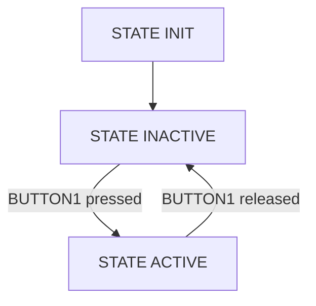

# simple-fsm-c

 The module can be used to create simple table-based FSM instances. Every FSM can hold up to FSM_MAX_NR_OF_STATES (1 - 255) with optional entry and exit functions.

 The FSM is designed to be used in Embedded Systems without dynamic memory allocation. Be aware that the fsm table always holds FSM_MAX_NR_OF_STATES items,even if there are less states used for some FSM instances.

 Every time fsmRun(&fsmHandle) is called, the FSM is executed once. On first call, the initial state will be executed without entry function.

 Example usage:



```c
 typedef enum
 {
     FSM_STATE_INIT,
     FSM_STATE_INACTIVE,
     FSM_STATE_ACTIVE,
 } FsmState_t;

 static uint8_t StateInit(void)
 {
     uint8_t nextState = FSM_STATE_INACTIVE;

     gpioInit(LED1_PORT, LED1_PIN, GPIO_OUPUT, GPIO_PIN_RESET);
     gpioInit(BUTTON1_PORT, BUTTON1_PIN, GPIO_INPUT);

     return nextState;
 }

 static void OnEntryInactive(void)
 {
     gpioSet(LED1_PORT, LED1_PIN, GPIO_PIN_RESET);
     printf("Enter state INACTIVE\r\n");
 }

 static uint8_t StateInactive(void)
 {
     uint8_t nextState = FSM_STATE_INACTIVE;

     if (GPIO_PIN_SET = gpioRead(BUTTON1_PORT, BUTTON1_PIN))
     {
         nextState = FSM_STATE_ACTIVE;
     }

     return nextState;
 }

 static void OnEntryActive(void)
 {
     gpioSet(LED1_PORT, LED1_PIN, GPIO_PIN_SET);
     printf("Enter state ACTIVE\r\n");
 }

 static uint8_t StateActive(void)
 {
     uint8_t nextState = FSM_STATE_ACTIVE;

     if (GPIO_PIN_RESET = gpioRead(BUTTON1_PORT, BUTTON1_PIN))
     {
         nextState = FSM_STATE_INACTIVE;
     }

     return nextState;
 }

 static void OnEntryActive(void)
 {
     printf("Exit state ACTIVE\r\n");
 }

 void main(void)
 {
     FsmHandle_t fsmHandle;

     fsmInit(&fsmHandle, FSM_STATE_INIT);

     fsmAdd(&fsmHandle, FSM_STATE_INIT,     StateInit,     onEntryOne,      NULL);
     fsmAdd(&fsmHandle, FSM_STATE_INACTIVE, StateInactive, OnEntryInactive, NULL);
     fsmAdd(&fsmHandle, FSM_STATE_ACTIVE,   StateActive,   OnEntryActive,   OnExitActive);

     while (1)
     {
         fsmRun(&fsmHandle);
     }
 }
 ```

 A real example usage can be found in my projects under [STM32F072_Template/Src/ledTask.c](https://github.com/mahlburgc/STM32F072_Template/blob/7091d2e5063ef4d9415fd98142568c6de89f187c/Src/ledTask.c#L85)
